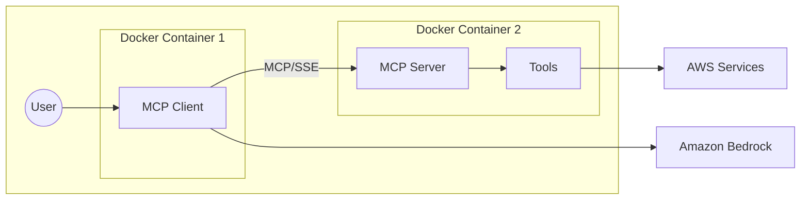

# Model Context Protocol (MCP) Service with AWS CDK

## Architecture Overview


## Prerequisites

- AWS CLI configured
- Docker installed
- Node.js (for CDK)
- Python 3.11+
- UV package manager

## Project Structure
```
.
├── docker/               # Docker configurations
├── infra/               # Infrastructure code
│   └── mcp-sse-cdk/    # CDK application
├── src/                 # Application code
└── requirements.txt     # Project dependencies
```

## Setup Instructions

1. **Install Dependencies**
```bash
# Create and activate virtual environment
uv venv
source .venv/bin/activate

# Install project dependencies
uv pip install -r requirements.txt
```

2. **Build Docker Images**
```bash
# Get AWS account ID
export AWS_ACCOUNT=$(aws sts get-caller-identity --query Account --output text)
export AWS_REGION=us-east-1

# Create ECR repository if it doesn't exist
aws ecr create-repository --repository-name mcp-sse

# Login to ECR
aws ecr get-login-password --region ${AWS_REGION} | docker login --username AWS --password-stdin ${AWS_ACCOUNT}.dkr.ecr.${AWS_REGION}.amazonaws.com

# Build images locally
docker build -f docker/server/Dockerfile -t server-image .
docker build -f docker/client/Dockerfile -t client-image .

# Tag images for ECR
docker tag server-image ${AWS_ACCOUNT}.dkr.ecr.${AWS_REGION}.amazonaws.com/mcp-sse:server-image
docker tag client-image ${AWS_ACCOUNT}.dkr.ecr.${AWS_REGION}.amazonaws.com/mcp-sse:client-image

# Push images to ECR
docker push ${AWS_ACCOUNT}.dkr.ecr.${AWS_REGION}.amazonaws.com/mcp-sse:server-image
docker push ${AWS_ACCOUNT}.dkr.ecr.${AWS_REGION}.amazonaws.com/mcp-sse:client-image
```

3. **Deploy Infrastructure**
```bash
# Navigate to CDK directory
cd infra/mcp-sse-cdk

# Install CDK dependencies
uv pip install -r requirements.txt

# Bootstrap CDK (first time only)
cdk bootstrap

# Synthesize CloudFormation template
cdk synth

# Deploy stack
cdk deploy
```

4. **Verify Deployment**
```bash
# Get Load Balancer DNS
export ALB_DNS=$(aws cloudformation describe-stacks \
    --stack-name McpSseCdkStack \
    --query 'Stacks[0].Outputs[?OutputKey==`LoadBalancerDNS`].OutputValue' \
    --output text)

# Test health endpoint
curl http://${ALB_DNS}/health

# Test query endpoint
curl -X POST http://${ALB_DNS}/query \
    -H "Content-Type: application/json" \
    -d '{"text": "Get me a greeting for Sarah"}'
```

## Cleanup

To avoid incurring charges, clean up resources:
```bash
# Delete CDK stack
cd infra/mcp-sse-cdk
cdk destroy

# Delete ECR images
aws ecr delete-repository --repository-name mcp-sse --force
```

## Security

- The infrastructure deploys into private subnets with NAT Gateway
- Security groups restrict access between components
- IAM roles follow principle of least privilege
- Bedrock access is restricted to specific models

## Architecture

- ECS Fargate for container orchestration
- Application Load Balancer for traffic distribution
- Service Connect for service discovery
- CloudWatch for logging and monitoring
- ECR for container image storage

## Troubleshooting

1. **Container Health Checks**
   - Verify target group health in EC2 Console
   - Ensure security group rules allow traffic

2. **Service Connect Issues**
   - Verify namespace creation in Cloud Map
   - Check service discovery endpoints

3. **Bedrock Access**
   - Verify IAM role permissions
   - Check regional endpoints
   - Validate model ARNs

For more detailed information, consult the AWS documentation or raise an issue in the repository.