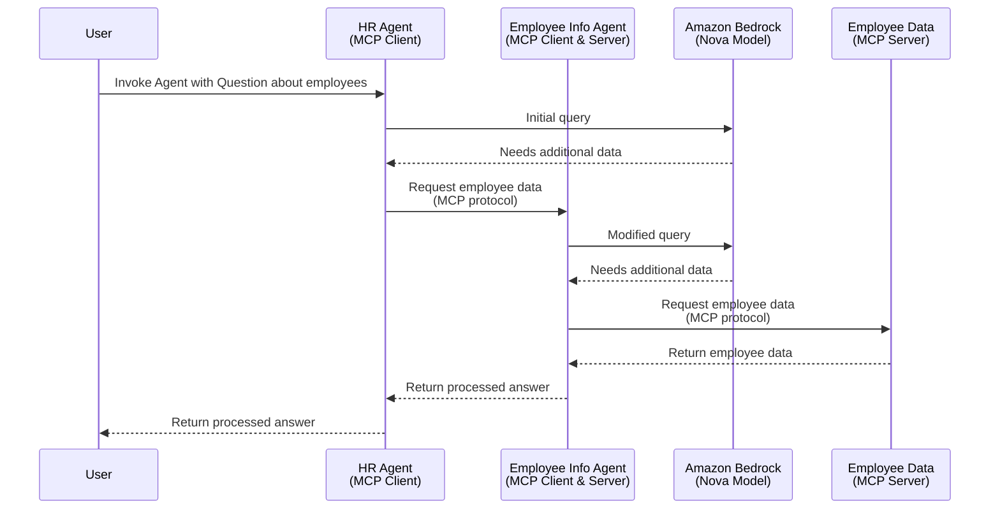

Strands MCP Inter-Agent Sample
------------------------------

# Sample: MCP Inter-Agent with Strands Agents and Bedrock

MCP-based agents (Bedrock + MCP client) can call other MCP-based agents by exposing them as MCP servers.
This example uses a hierarchy of agents with where the outer agent calls (using MCP) an inner agent that does routing and prompt modification, which then calls another MCP server.



## Setup

1. Setup Bedrock in the AWS Console, [request access to Nova Micro](https://us-east-1.console.aws.amazon.com/bedrock/home?region=us-east-1#/modelaccess)
1. [Setup auth for local development](https://docs.aws.amazon.com/cli/v1/userguide/cli-chap-authentication.html)

## Run Locally

Start the Employee MCP Server
```
uv run employee_server/server.py
```

Start the Employee Agent:
```
uv run employee_agent/agent.py
```

Start the HR Agent:
```
uv run hr_agent/agent.py
```

Make a request to the server REST endpoint:

In IntelliJ, open the `client.http` file and run the request.

Or via `curl`:
```
curl -X POST --location "http://localhost:8000/invocations" \
    -H "Content-Type: application/json" \
    -d '{"question": "list employees that have skills related to AI programming"}'
```

## Run on Amazon Bedrock AgentCore Runtime

Deploy with CDK
```
npx aws-cdk bootstrap
npx aws-cdk deploy
```

This will take a few minutes and then return the ARNs for the agents.
To test the HR Agent, run:
```
export AGENT_ARN=<HR Agent ARN>
uv run test/invoke_agent.py
```
